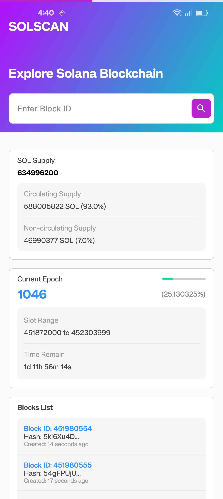
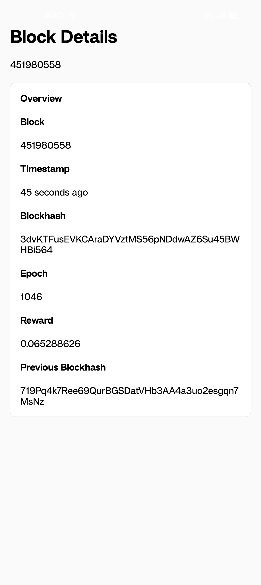

# Solana Block Explorer — GetBlock JSON-RPC

An Android application that uses the [GetBlock](https://getblock.io/) JSON-RPC API to explore the **Solana** blockchain in real time. Built with **Kotlin**, **Jetpack Compose**, and the **MVI** architecture pattern.

---

## Screenshots

| Main Screen | Block Details |
|:-----------:|:-------------:|
|  |  |

---

## Features

- 📊 **SOL Supply** — displays circulating, non-circulating, and total SOL supply with percentages
- 🕐 **Epoch Info** — current epoch number, slot range, progress percentage, and estimated time remaining
- 📋 **Block List** — fetches the 10 most recent confirmed blocks with timestamp, blockhash, and validator reward
- 🔍 **Block Search** — search any block by slot number and navigate to its detail page
- 🔄 **Auto-refresh** — data is automatically refreshed every 60 seconds
- 📱 **Block Detail Screen** — full block information including blockhash, previous blockhash, elapsed time, and total reward in SOL

---

## Tech Stack

| Category | Technology |
|---|---|
| Language | Kotlin 2.0 |
| UI | Jetpack Compose + Material 3 |
| Architecture | MVI (Model–View–Intent) |
| Navigation | Navigation Compose |
| Networking | Ktor Client (CIO engine) |
| Serialization | kotlinx.serialization |
| Async | Kotlin Coroutines + StateFlow / SharedFlow |
| Min SDK | 24 (Android 7.0) |
| Target SDK | 35 (Android 15) |

---

## Architecture

The project follows a clean **MVI** pattern:

```
app/
└── src/main/java/com/example/getblock/
    ├── data/
    │   ├── api/          # ApiService (Ktor), ApiKey / BASE_URL
    │   └── model/        # RpcRequest, RpcResponse, Block, Epoch, Supply
    ├── domain/
    │   ├── UseCase.kt    # Business logic: fetch supply, epoch, block list
    │   └── Utils.kt      # Helpers: time formatting, percentage calculation
    └── mvi/
        ├── intent/       # MainIntent, BlockIntent (sealed classes)
        ├── reducer/      # Pure reducer functions
        ├── state/        # MainState, BlockState
        ├── viewmodel/    # MainViewModel, BlockViewModel
        └── view/
            ├── MainScreen.kt
            ├── BlockScreen.kt
            └── components/   # SupplyCard, EpochCard, BlockListCard, BlockCard, SearchBar, TopPart
```

---

## How It Works

1. On launch, `MainViewModel` immediately triggers `LoadData` and enters a **60-second polling loop**.
2. `UseCase.fetchData()` fires three parallel RPC calls via `ApiService`:
   - `getSupply` → circulating / non-circulating / total SOL
   - `getEpochInfo` → current epoch, slot index, slots in epoch
   - `getBlocks` + per-block `getBlock` → list of the 10 latest blocks with details
3. All state is held in `MainState` (a single immutable data class) and updated through the `mainReducer`.
4. Tapping a block row or submitting a slot ID in the search bar navigates to `BlockDetailScreen` via `NavHostController`.

---

## Getting Started

### Prerequisites

- Android Studio Hedgehog or newer
- A free [GetBlock](https://getblock.io/) account and API key

### Setup

1. Clone the repository:
   ```bash
   git clone https://github.com/your-username/solana-block-explorer.git
   ```

2. Open the project in Android Studio.

3. Replace the API key in [`ApiKey.kt`](app/src/main/java/com/example/getblock/data/api/ApiKey.kt):
   ```kotlin
   private const val API_KEY = "YOUR_GETBLOCK_API_KEY"
   ```

4. Build and run on an emulator or physical device (API 24+).

---

## RPC Methods Used

| Method | Purpose |
|---|---|
| `getSupply` | Total, circulating, and non-circulating SOL |
| `getEpochInfo` | Current epoch number, slot index, slots in epoch |
| `getBlocks` | List of confirmed slot numbers in a range |
| `getBlock` | Full block data (blockhash, blockTime, rewards) |

---

## License

This project is open source and available under the [MIT License](LICENSE).
